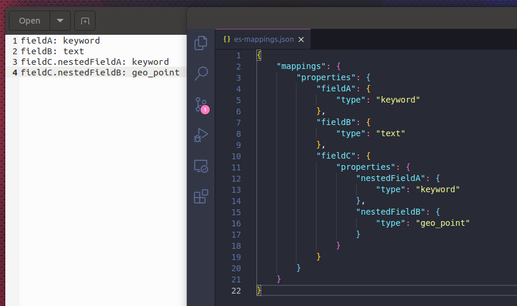

# es-mapping-creator

simple golang cli tool to help create elasticsearch mappings.

## how it works?

the cli tool reads a file name `mapping.txt` and creates a file named `es-mappings.json` with the mapping.



the lines in the `mapping.txt` file should have the following format:

```
field: type
otherField.nestedField: type
```

currently only top-level fields and nested fields with one level are supported.

## TO DO

[] pass source and destination files from command line  
[] multi-level nested fields  
[] fields multi-fields mappings  
[] option to add ecs fields  
[] validate field type  
[] dynamic mappings  
[] option to create template with index settings  
[] tests  